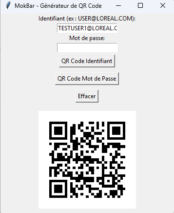

# 🏢  Application Mokbar- Générateur de QR Code s'authentifier plus facilement


## 🎯 Objectif

Ce projet a pour but de fournir une **interface simple** permettant de saisir un identifiant et un mot de passe, puis de **générer un QR Code** encodant ces informations. Ce QR Code peut ensuite être scanné pour un accès rapide et sécurisé.

---

## 📸 Interface Utilisateur



L'interface graphique comprend :

- Un champ pour saisir l'**Identifiant**
avec une regex forcant les majuscules et l'id = LOREAL.COM
- Un champ pour saisir le **Mot de passe**
- Un bouton **"Générer QR Code"**
- Une zone d'affichage du **QR Code généré**
- Un bouton de réinitialisation qui efface tout

---

## ⚙️ Fonctionnement technique

Ce projet est construit en **Python** avec **Tkinter** pour l'interface graphique et **qrcode** pour générer le QR Code.

Vous pouvez trouver une version en Auto IT qui utilise l'API https://chart.googleapis.com/chart?chs=50x50&cht=qr&chl= 

La version auto IT est compilé en .exe et permet une éxécution et l'impression sur une imprimante zebra zm-400 à impression thermique, le script zebra un gérer par un driver généric text qui permet l'agencement de l'étiquette d'impression.

### 🔧 Installation des dépendances

Assure-toi d'avoir Python installé, puis installe les dépendances :

```bash
pip install qrcode[pil] pillow

```

Ce fut mon premier projet chez l'Oréal que j'ai consu et mis en production en 3 semaines.

date de mise en production 25 octobre 2023

J'ai reçu de nombreux retours positifs de la part des employés, pour qui cette application fait gagner du temps quotidiennement. L'application est toujours en production et utilisée chaque jour par 200 personnes à l'été 2025.


